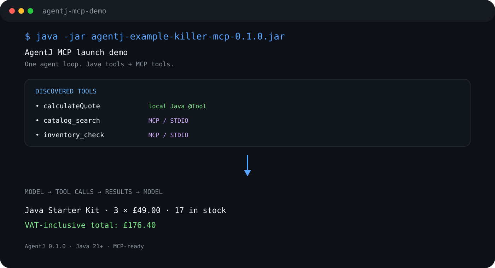

# AgentJ

**Java-native AI agent framework for tool calling, MCP, and LLM-powered applications.**

Build AI agents in **Java 21+** that can use your existing Java methods and **Model Context Protocol (MCP)** tools in the same agent loop.

**Plain Java. Small core. Provider-neutral. MCP-ready.**

[](https://github.com/anirudhnshandilya/agentj/actions/workflows/ci.yml)


<p align="center">
  
</p>

---

## What is AgentJ?

AgentJ is a lightweight **Java AI agent runtime** for building LLM-powered applications that can discover and invoke tools.

It gives an AI model one unified tool surface containing:

* ☕ **Local Java methods** exposed with `@Tool`
* 🔌 **MCP tools** discovered from MCP servers
* 🤖 **LLM model adapters** through a provider-neutral `Model` interface
* 🧠 **Memory** for conversation state
* 🔎 **Tracing** for model and tool execution
* 🧩 **Composite tool providers** for combining multiple tool sources

The result is simple:

```text
                    AgentJ
                      │
                 ┌────┴────┐
                 │  Agent  │
                 │ LLM loop│
                 └────┬────┘
                      │
             ┌────────┴────────┐
             ▼                 ▼
       Java @Tool            MCP
       methods              servers
             │                 │
             └────────┬────────┘
                      ▼
                  Tool calls
                      │
                      ▼
                  Final result
```

AgentJ is designed for developers who want to build AI agents **without replacing their existing Java application architecture**.

Your Java objects, methods, tests, and application boundaries stay yours.

AgentJ provides the agent loop around them.

---

# Why AgentJ?

If your application already has useful Java methods, **those methods can become AI tools**.

Instead of creating a separate tool service or adopting an entirely different programming model, you can expose ordinary Java methods to the agent:

```java
final class Tools {

    @Tool(description = "Add two integers.")
    public int add(int a, int b) {
        return a + b;
    }
}

var agent = Agent.builder()
        .model(OpenAIResponsesModel.fromEnv())
        .tools(new Tools())
        .build();

System.out.println(
        agent.run("Use the add tool to calculate 19 + 23.")
);
```

The model can decide when the tool is useful, invoke it, receive the result, and continue the agent loop.

---

# Java tools + MCP in the same agent

MCP becomes another tool source behind the same `ToolProvider` boundary.

```text
        ┌────────────── AgentJ ──────────────┐
        │                                    │
        │             LLM Agent              │
        │                 │                  │
        │          ToolProvider              │
        │           ┌─────┴─────┐            │
        │           ▼           ▼            │
        │      Java Tools      MCP Tools     │
        │           │           │            │
        └───────────┴───────────┴────────────┘
```

This is the core idea behind AgentJ:

> **Your Java code and your MCP ecosystem become one tool surface for the agent.**

For example:

```java
try (var mcp = McpStdio.connect(
        "my-mcp-server",
        List.of("--stdio"))) {

    var local = new ToolRegistry(new ObjectMapper())
            .register(new Tools());

    var tools = new CompositeToolProvider(local, mcp);

    var agent = Agent.builder()
            .model(OpenAIResponsesModel.fromEnv())
            .toolRegistry(tools)
            .build();

    System.out.println(
            agent.run("Use the available tools to complete the task.")
    );
}
```

The API is intentionally small:

**Java methods + MCP capabilities → one agent tool surface.**

---

# 60-second MCP demo

The repository includes a self-contained end-to-end example combining:

**Java `@Tool` + MCP + OpenAI + agent tool calling**

The demo packages the AgentJ client and a tiny MCP server into a runnable shaded JAR.

The client launches the MCP server over STDIO, discovers its tools, combines them with a normal Java tool, and lets the model decide what to call.

### The demo workflow

The default task asks the agent to:

1. Search the product catalog
2. Check inventory
3. Invoke a local Java calculation tool
4. Calculate a VAT-inclusive order total
5. Continue the agent loop
6. Produce a concise order summary

The resulting tool surface contains:

```text
Local Java tool
    calculateQuote

MCP tools
    catalog_search
    inventory_check
```

The important part is that the model can use all of them inside the **same agent loop**.

### Run the demo

Requirements:

* **JDK 21+**
* An API key for the model provider configured by the OpenAI adapter

#### macOS / Linux

```bash
export OPENAI_API_KEY="your-key"

./mvnw -pl examples/killer-mcp -am package

java -jar examples/killer-mcp/target/agentj-example-killer-mcp-0.1.0.jar
```

#### Windows PowerShell

```powershell
$env:OPENAI_API_KEY = "your-key"

.\mvnw.cmd -pl examples/killer-mcp -am package

java -jar .\examples\killer-mcp\target\agentj-example-killer-mcp-0.1.0.jar
```

You should see the MCP server start and the available tools being discovered.

Example:

```text
AgentJ MCP launch demo
======================

Discovered tools:
  calculateQuote
  catalog_search
  inventory_check

Agent execution:
```

The repository includes the complete source for the demo:

* [`examples/killer-mcp`](https://github.com/anirudhnshandilya/agentj/tree/main/examples/killer-mcp)
* [`docs/DEMO.md`](https://github.com/anirudhnshandilya/agentj/blob/main/docs/DEMO.md)

---

# Give the agent your own task

The demo JAR accepts a task as an argument:

```bash
java -jar examples/killer-mcp/target/agentj-example-killer-mcp-0.1.0.jar \
  "Find the Java Starter Kit, check whether 5 are available, and calculate the VAT-inclusive total."
```

This makes the example useful as both a quick demonstration and a starting point for experimenting with AgentJ.

---

# What is included in 0.1.0?

AgentJ 0.1.0 includes:

| Capability                   | Description                                                       |
| ---------------------------- | ----------------------------------------------------------------- |
| **Java 21+**                 | Modern Java runtime and language features                         |
| **`@Tool` reflection**       | Register methods on your own Java objects as model-callable tools |
| **Tool schemas**             | Generate descriptions for Java method parameters                  |
| **Provider-neutral `Model`** | Keep the core independent of a model vendor                       |
| **OpenAI Responses adapter** | HTTP-based integration in `agentj-openai`                         |
| **MCP bridge**               | Consume tools from MCP servers                                    |
| **STDIO / Streamable HTTP**  | MCP transport support                                             |
| **Memory**                   | In-memory and JSON-file implementations                           |
| **Tracing**                  | No-op and logging implementations                                 |
| **Composite tools**          | Combine local and external tool sources                           |
| **Starter CLI**              | Environment diagnostics and project initialization                |
| **MCP example**              | Runnable Java + MCP + model example                               |

---

# Architecture

AgentJ intentionally keeps the runtime small and exposes a small number of important interfaces.

| Component               | Responsibility                                 |
| ----------------------- | ---------------------------------------------- |
| `Agent`                 | Bounded synchronous model/tool execution loop  |
| `Model`                 | Provider-neutral model generation interface    |
| `ToolProvider`          | Common discovery/invocation seam for tools     |
| `ToolRegistry`          | Local Java `@Tool` registration and invocation |
| `CompositeToolProvider` | Combine local and external tools               |
| `Memory`                | Conversation state                             |
| `Tracer`                | Execution events                               |
| `agentj-openai`         | OpenAI Responses API adapter                   |
| `agentj-mcp`            | MCP tool bridge                                |
| `agentj-cli`            | Starter command-line utilities                 |

```text
agentj-core
   │
   ├── Agent ───────── Model
   │      │
   │      ├────────── ToolProvider
   │      │              ├── ToolRegistry
   │      │              │     └── @Tool Java methods
   │      │              │
   │      │              └── McpToolProvider
   │      │                    └── MCP tools
   │      │
   │      ├────────── Memory
   │      │
   │      └────────── Tracer
   │
   ├── agentj-openai
   │
   └── agentj-mcp
```

More detail:

[`ARCHITECTURE.md`](https://github.com/anirudhnshandilya/agentj/blob/main/ARCHITECTURE.md)

---

# Modules

```text
agentj-core
    → runtime interfaces, agent loop, tools, memory, tracing

agentj-openai
    → OpenAI Responses API adapter

agentj-mcp
    → MCP tool provider

agentj-cli
    → command-line utilities

examples/basic
    → minimal local-tool example

examples/killer-mcp
    → Java tools + MCP + model launch demo
```

---

# Quick start

## Clone

```bash
git clone https://github.com/anirudhnshandilya/agentj.git
cd agentj
```

## Build and test

macOS / Linux:

```bash
./mvnw test
```

Windows PowerShell:

```powershell
.\mvnw.cmd test
```

Package everything:

```bash
./mvnw package
```

---

# Basic agent

The basic example demonstrates local Java tools with the OpenAI adapter.

```bash
export OPENAI_API_KEY="your-key"

./mvnw -pl examples/basic -am package
```

See:

[`examples/basic`](https://github.com/anirudhnshandilya/agentj/tree/main/examples/basic)

for the complete minimal application.

---

# MCP agent

For the complete Java + MCP + LLM example:

```bash
./mvnw -pl examples/killer-mcp -am package

java -jar examples/killer-mcp/target/agentj-example-killer-mcp-0.1.0.jar
```

Windows PowerShell:

```powershell
.\mvnw.cmd -pl examples/killer-mcp -am package

java -jar .\examples\killer-mcp\target\agentj-example-killer-mcp-0.1.0.jar
```

See:

[`examples/killer-mcp/README.md`](https://github.com/anirudhnshandilya/agentj/blob/main/examples/killer-mcp/README.md)

---

# MCP integration

AgentJ's MCP integration is built on the **official Java MCP SDK**.

The SDK provides Java MCP clients and servers and standard MCP transports.

AgentJ keeps MCP behind its `ToolProvider` boundary so MCP capabilities can participate in the same tool surface as ordinary Java methods.

Official Java MCP SDK:

https://github.com/modelcontextprotocol/java-sdk

---

# Security model

AgentJ does **not** sandbox Java tools.

An `@Tool` method executes with the same privileges as the hosting Java process.

MCP tools are capabilities supplied by the connected MCP server.

Treat tools as privileged capabilities.

For production systems, add the authentication, authorization, network and filesystem restrictions, input validation, and human-approval controls appropriate to your environment.

MCP tool metadata should also be treated as untrusted unless the server is trusted. Tool descriptions and annotations should not be treated as a security boundary.

Read the full security guidance:

[`SECURITY.md`](https://github.com/anirudhnshandilya/agentj/blob/main/SECURITY.md)

---

# Design principles

AgentJ is intentionally built around a few simple ideas.

### 1. Java stays Java

AgentJ is designed around normal Java objects and methods.

You don't need to rewrite your application around an agent-specific language or programming model.

### 2. Tools are capabilities

The agent interacts with tools through a common interface.

Those tools can come from:

* your Java application
* MCP servers
* future external providers

### 3. Keep the core small

The runtime focuses on the agent loop and the interfaces needed to connect models, tools, memory, and tracing.

Integrations live outside the core where possible.

### 4. Model providers stay replaceable

The core uses a provider-neutral `Model` interface.

The current release includes an OpenAI Responses API adapter, while the architecture allows additional model providers to sit behind the same interface.

### 5. MCP is an integration boundary

MCP tools don't need to become special cases inside the agent runtime.

They participate through `ToolProvider`, allowing local Java tools and MCP tools to be combined.

---

# Project status

## 0.1.0 — Early Access

AgentJ is currently an early-stage project.

The public API is intentionally small and may evolve as the project develops.

The current release is useful for:

* experimentation
* prototypes
* internal applications
* learning about Java agent architectures
* building MCP-powered Java applications
* contributors interested in lightweight Java AI tooling

The current execution loop is synchronous and bounded.

---

# Roadmap

Near-term areas include:

* More model adapters behind the same `Model` interface
* Stronger schema generation for Java types
* Streaming execution
* Asynchronous execution paths
* Tool approval and policy hooks
* More MCP transports
* Expanded integration tests
* Observability integrations
* More real-world examples

The project is intentionally focused on keeping the core lightweight while expanding its integration surface.

---

# Contributing

Contributions are welcome.

Useful contributions include:

* Bug fixes
* Tests
* Documentation
* Examples
* Model adapters
* MCP integrations
* Tooling
* Observability integrations
* API improvements

Run the test suite before submitting changes:

```bash
./mvnw test
```

Windows:

```powershell
.\mvnw.cmd test
```

Please keep the core small, add tests for behavioral changes, and update user-facing documentation when APIs change.

See:

[`CONTRIBUTING.md`](https://github.com/anirudhnshandilya/agentj/blob/main/CONTRIBUTING.md)

---

# License

AgentJ is released under the **MIT License**.

See [`LICENSE`](https://github.com/anirudhnshandilya/agentj/blob/main/LICENSE).

---

# Links

* 🚀 [Killer MCP demo](https://github.com/anirudhnshandilya/agentj/tree/main/examples/killer-mcp)
* 🎬 [Terminal demo guide](https://github.com/anirudhnshandilya/agentj/blob/main/docs/DEMO.md)
* 🏗️ [Architecture](https://github.com/anirudhnshandilya/agentj/blob/main/ARCHITECTURE.md)
* 📝 [Changelog](https://github.com/anirudhnshandilya/agentj/blob/main/CHANGELOG.md)
* 🤝 [Contributing](https://github.com/anirudhnshandilya/agentj/blob/main/CONTRIBUTING.md)
* 🔐 [Security](https://github.com/anirudhnshandilya/agentj/blob/main/SECURITY.md)
* ☕ [Basic example](https://github.com/anirudhnshandilya/agentj/tree/main/examples/basic)
* 💬 [GitHub Issues](https://github.com/anirudhnshandilya/agentj/issues)
* 🔌 [Official Java MCP SDK](https://github.com/modelcontextprotocol/java-sdk)

---

## ⭐ Star AgentJ

If you're building **AI agents in Java**, experimenting with **MCP**, or interested in lightweight **LLM tooling for Java**, consider starring the repository and following the project.

**AgentJ — build AI agents with the Java you already know.**
